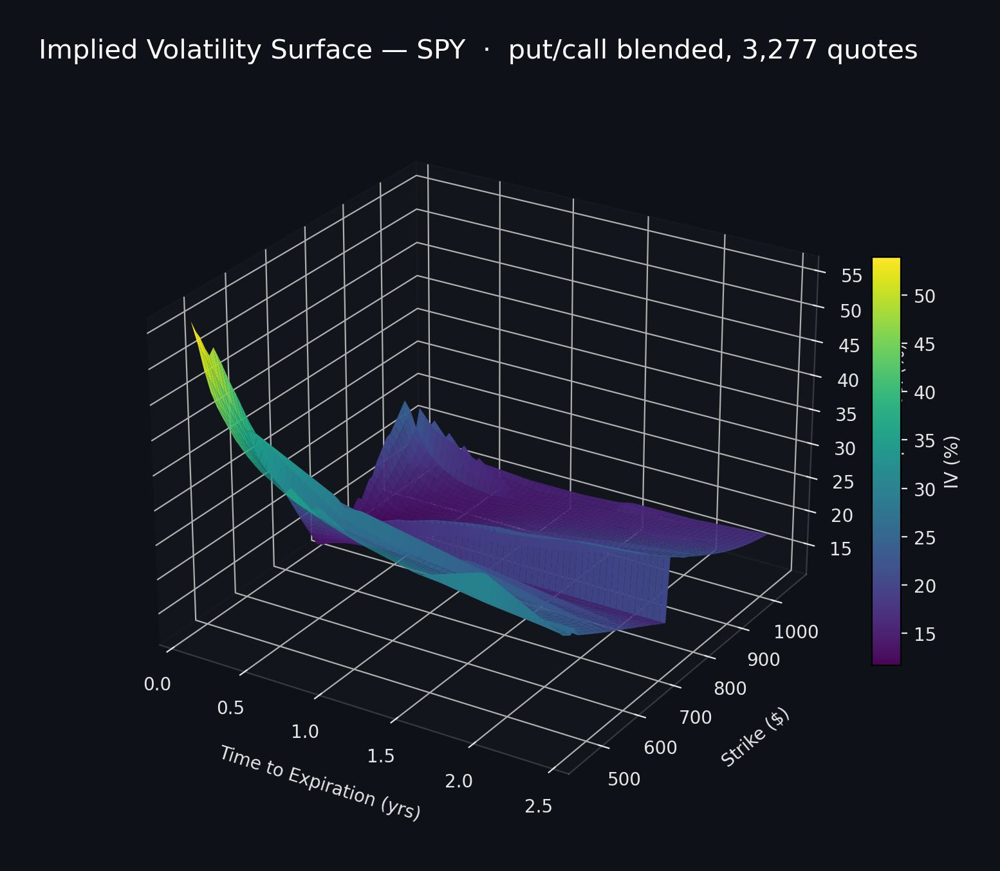
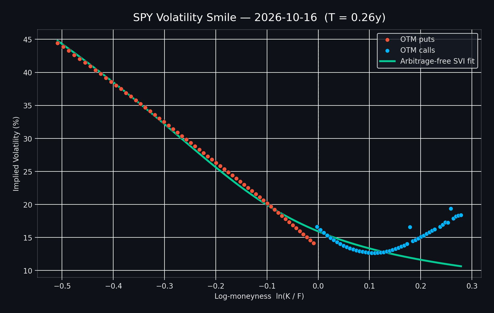

# Volatility Surface

An interactive Streamlit app that visualizes a **3D implied volatility surface** for options on a chosen stock ticker.  
Explore how implied volatility varies across **time to expiration** and either **strike** or **moneyness**.

---
## Features

- **Flexible Ticker Symbol**: Analyze options for any supported ticker (via Yahoo Finance / `yfinance`).
- **OTM put/call blend**: The surface is built from out-of-the-money options on each side (OTM puts below spot, OTM calls above) — the liquid, informative quotes — instead of calls only.
- **Configurable Inputs**:
  - **Risk-Free Rate** and **Dividend Yield**: User-defined (scenario testing).
  - **Strike Range Filter**: Choose a strike range as a percentage of spot price.
  - **Liquidity Filters**: Minimum volume, minimum open interest, and maximum bid-ask spread (%).
  - **Y-Axis Selection**: **Strike Price** or **Log-moneyness** \(\ln(K/F)\), where \(F = S \cdot e^{(r-q)T}\).
- **Two surface methods**:
  - **Raw (interpolated)** — grid interpolation of the observed IV points.
  - **SVI fit** — an arbitrage-free Gatheral SVI smile fit per expiry for a smooth surface.
- **Smile / Skew viewer**: 2D implied-vol-vs-strike plot for a chosen expiry, with the SVI fit overlaid.
- **Export**: Download the IV points as CSV and the surface as an interactive HTML file.
- **Fast & cached**: Network fetches and IV solves are cached and run in parallel, so moving the sliders is instant.

---

## Visualization

**3D implied volatility surface** (put/call blended):



**Volatility smile / skew** for a single expiry, with the arbitrage-free SVI fit overlaid:



---

## Setup Instructions

1) **Clone the Repository**:
   ```bash
    git clone https://github.com/George-Dros/Volatility_Surface
    cd Volatility_Surface
    ```

2) **Create and activate a virtual environment**
   ```bash
   py -3.12 -m venv .venv
    .\.venv\Scripts\Activate.ps1
    ```

3) **Install requirements**
    ```bash
    pip install -r requirements.txt
    ```

4) **Run the Streamlit app**
    ```bash
    streamlit run app.py
    ```

---

## How it works


1. Data Collection: Fetches call and put option chains, expirations, strikes, and market prices via `yfinance` (chains fetched in parallel and cached).

2. OTM blend & filtering: Keeps the out-of-the-money side per strike (puts ≤ spot, calls > spot), drops very short-dated expirations, and applies strike/liquidity filters.

3. Implied Volatility Calculation: Solves for σ in the Black–Scholes model (with dividend yield q) using Brent's method, on the mid price (falling back to last price).

4. Surface Construction: Either interpolates the IV points onto a grid, or fits an arbitrage-free SVI smile per expiry, then plots a 3D surface with Plotly.

---

## Testing

```bash
pip install -r requirements-dev.txt
pytest
```

The suite covers the Black–Scholes/IV round-trip, time-to-expiry determinism, the OTM-blend + liquidity pipeline, and the SVI fit. It runs in CI (GitHub Actions) on every push and pull request.

---

## Notes / Limitations

- Data quality depends on Yahoo Finance quotes; some tickers/expirations may return sparse or missing data.

- The SVI fit enforces no *butterfly* (per-expiry) arbitrage via parameter bounds, but does **not** enforce *calendar* arbitrage across expiries.

---

## Use Cases

 1. Volatility Smile / Skew Inspection: Visualize skew patterns across maturities and strikes/moneyness.
    
 2. Scenario Testing: Change r and q to see how assumptions affect the surface.
    
 3. Learning Tool: A quick way to connect option market prices to implied vol behavior.

---

## Future Enhancements

- Calendar-arbitrage-free surface fitting (currently only per-expiry butterfly arbitrage is constrained).

- Greeks display and a term-structure (ATM vol vs. expiry) view.

- PNG/static image export (currently CSV + interactive HTML).

---

## License

  This project is open-source and available under the MIT License.

  Created by Georgios Drosogiannis
