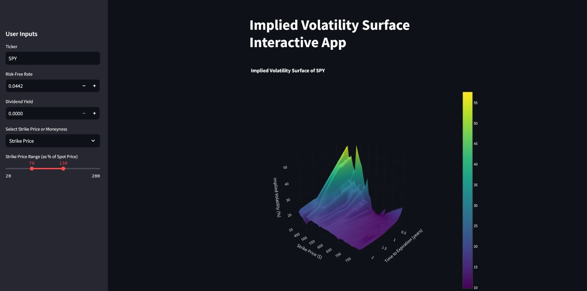

# Volatility Surface

An interactive Streamlit app that visualizes a **3D implied volatility surface** for options on a chosen stock ticker.  
Explore how implied volatility varies across **time to expiration** and either **strike** or **moneyness**.

---
## Features

- **Flexible Ticker Symbol**: Analyze options for any supported ticker (via Yahoo Finance / `yfinance`).
- **Configurable Inputs**:
  - **Risk-Free Rate**: User-defined (for scenario testing / current market assumptions).
  - **Dividend Yield**: User-defined (scenario testing).
  - **Strike Range Filter**: Choose a strike range as a percentage of spot price.
  - **Y-Axis Selection**:
    - **Strike Price**, or
    - **Log-moneyness**:  \(\ln(K/F)\), where \(F = S \cdot e^{(r-q)T}\)
- **3D Volatility Surface Plot**:
  - X-axis: Time to expiration (years)
  - Y-axis: Strike price or log-moneyness
  - Z-axis: Implied volatility (%)

---

## Visualization

Example output from the app:



---

## Setup Instructions

1) **Clone the Repository**:
   ```bash
    git clone https://github.com/George-Dros/Volatility_Surface
    cd Volatility_Surface
    ```

2) **Create and activate a virtual environment**
   ```bash
   py -3.12 -m venv .venv
    .\.venv\Scripts\Activate.ps1
    ```

3) **Install requirements**
    ```bash
    pip install -r requirements.txt
    ```

4) **Run the Streamlit app**
    ```bash
    streamlit run app.py
    ```

---

## How it works


1. Data Collection: Fetches option chain data (calls), expirations, strikes, and market prices via `yfinance`.

2. Filtering: Filters options by strike range and removes very short-dated expirations.

3. Implied Volatility Calculation: Computes implied volatility by solving for σ in the Black–Scholes model (with dividend yield q) using a root-finder.

4. Surface Construction: Interpolates the IV points onto a grid and plots a 3D surface with Plotly.

---

## Notes / Limitations

- Data quality depends on Yahoo Finance quotes; some tickers/expirations may return sparse or missing data.

- Surfaces can look noisy for illiquid options (wide bid/ask spreads, stale last prices).

- Current implementation focuses on calls.

---

## Use Cases

 1. Volatility Smile / Skew Inspection: Visualize skew patterns across maturities and strikes/moneyness.
    
 2. Scenario Testing: Change r and q to see how assumptions affect the surface.
    
 3. Learning Tool: A quick way to connect option market prices to implied vol behavior.

---

## Future Enhancements

- Add puts and put/call parity checks.

- Liquidity filters (volume/open interest/spread) as UI controls.

- Surface export (CSV + image).

- Alternative smoothing/interpolation methods or model fits (e.g., SVI).

---

## License

  This project is open-source and available under the MIT License.

  Created by Georgios Drosogiannis
